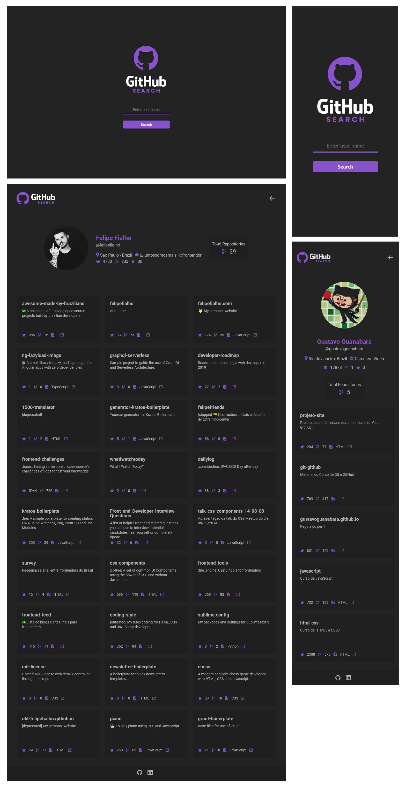

<br />
<p align="center">
    
    <br />

  <h3 align="center">Github search profile, by <a href="https://github.com/felpssc">Felipe Silva</a></h3>
 <br />
  <p align="center">
     Perfil de um usuário no Github
       <br />
    <br />
    <a href="https://github.com/Diegooliveyra/Github_Search">Desafio</a>
    ·
    <a href="https://www.devchallenge.com.br/">DevChallenge</a>
    ·
    <a href="https://github-search-felpssc.vercel.app">Live preview</a>
  </p>
</p>

## Índice

* [Devchallenge](#devchallenge) 
* [Desafio](#desafio)
* [Techs](#techs)
* [Modelo](#modelo-da-aplicação)
* [Instalação e uso](#instalação-e-uso)

# Devchallenge
O<a href="https://devchallenge.now.sh/"> DevChallenge</a> permite a evolução das skills como programador, com vários desafios Front-end, Back-end e Mobile.

# Desafio
O desafio foi criar um site de busca de usuários e repositórios do github através da sua API!
## Requisitos:
- A pagina inicial precisa ter um campo de busca, a busca devera ser feita ao clicar no botão de busca<br>
- A resposta da página deverá exibir as informaçes do usuario, tais como nome, followers , following, stars, empresa e localização<br>
- A resposta da página deverá exibir as informaçes dos repositórios, tais como o nome do repositório, descrição do projeto, stars, forks e um link que direciona para o repositório no Github<br>


# Techs: 
Tecnologias e ferramentas utilizadas no desenvolvimento do projeto:

- [React](https://reactjs.org/)
- [React icons](https://react-icons.github.io/react-icons)
- [Styled Components](https://styled-components.com/)

## Modelo da aplicação:

<p align="center">
    
</p>

## Aplicação acessível em: [Github Search](https://github-search-felpssc.vercel.app/)

<br>

## Instalação e uso

```bash
# Abra um terminal e copie este repositório com o comando
$ git clone https://github.com/felpssc/React-todoApp.git
# ou use a opção de download.

# Entre na pasta raiz do projeto e instale as dependências com:
$ yarn

# Rode a aplicação
$ yarn start

# Acesse http://localhost:3000 no seu navegador.
```

<br>


Desenvolvido com 💜 by [Felipe Silva](https://github.com/felpssc) ;)

[](https://www.linkedin.com/in/felipesilva-1/) 
[](mailto:carlosfelipesilva.fs@gmail.com)